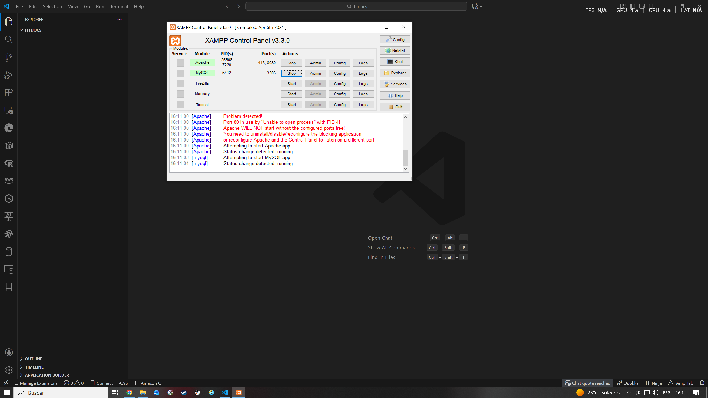

# HILET - Prog Web Intensivo

> 📚 Repository for the intensive Web Programming course: practice and resources to learn web development from scratch.

## 📌 Description

This repository contains all the material used and developed during the **intensive Web Programming course**. It includes exercises, projects, assets (images, fonts, etc.), and documentation to reinforce concepts of HTML, CSS, JavaScript, and other topics related to modern web development.

---

## 🧱 Repository content

The main structure includes:

- `additional material/` → Supplementary material or extra resources  
- `assets/` → Images and other multimedia files  
- `certifications/` → Course certificates (if applicable)  
- `class/` → Folder containing class content  
- `software/` → Tools or installers  
- Other course files for practice or examples  

> Note: Each folder may contain its own README or practical examples with more details.

---

## 🚀 Technologies used

This intensive course covers (but is not limited to):

- **HTML5** – Web page structure  
- **CSS3** – Modern styles and layouts  
- **JavaScript** – Client-side interactivity  
- **PHP (if applicable)** – Basic backend  
- Other tools and libraries as the course progresses 
